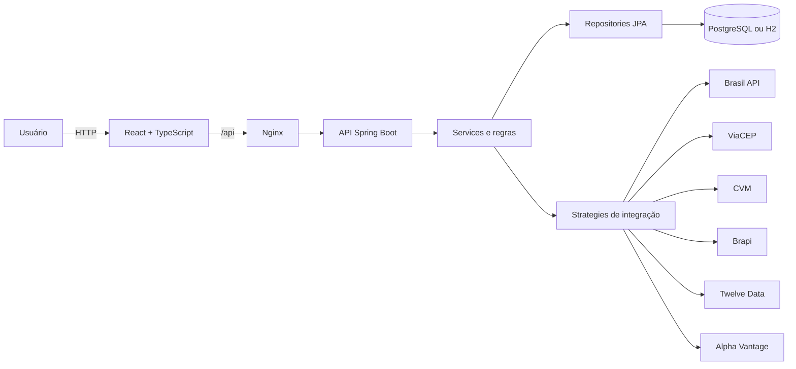

# Bom Investidor

Aplicação web para gestão privada de investimentos em ações e ETFs brasileiros e americanos. O sistema reúne cadastro de corretoras, carteiras, ativos, compras, vendas, posições, valorização, evolução patrimonial e proventos em uma interface responsiva com temas claro e escuro.

O projeto é formado por uma API REST em Java e Spring Boot, uma interface React com TypeScript e bancos H2 ou PostgreSQL. Também pode ser executado integralmente com Docker Compose.

## Sumário

- [Visão geral](#visão-geral)
- [Funcionalidades](#funcionalidades)
- [Perfis de acesso](#perfis-de-acesso)
- [Regras de negócio](#regras-de-negócio)
- [Arquitetura](#arquitetura)
- [Tecnologias](#tecnologias)
- [Estrutura do repositório](#estrutura-do-repositório)
- [Início rápido com Docker](#início-rápido-com-docker)
- [Operação diária com Docker](#operação-diária-com-docker)
- [Consultar o PostgreSQL](#consultar-o-postgresql)
- [Execução sem Docker](#execução-sem-docker)
- [Configuração](#configuração)
- [Integrações externas](#integrações-externas)
- [Banco de dados e migrations](#banco-de-dados-e-migrations)
- [API e autenticação](#api-e-autenticação)
- [Testes e qualidade](#testes-e-qualidade)
- [Segurança](#segurança)
- [Solução de problemas](#solução-de-problemas)
- [Fluxo de desenvolvimento](#fluxo-de-desenvolvimento)
- [Documentação complementar](#documentação-complementar)

## Visão geral

O Bom Investidor ajuda um investidor a organizar seus ativos em múltiplas carteiras e corretoras. Os dados de cada investidor são isolados e as informações de mercado são obtidas por integrações específicas para Brasil e Estados Unidos.

Uma jornada típica é:

1. criar uma conta ou entrar no sistema;
2. cadastrar uma corretora validada por CNPJ, CEP e CVM;
3. cadastrar ações ou ETFs no catálogo pessoal de ativos;
4. criar uma carteira vinculada a uma corretora;
5. registrar compras e vendas usando os ativos cadastrados;
6. acompanhar posições, preço médio, patrimônio, rentabilidade e composição;
7. identificar, confirmar ou registrar manualmente proventos;
8. consultar o histórico e a evolução da carteira.

O sistema não calcula impostos e não executa ordens em bolsa. Ele registra e consolida informações fornecidas pelo investidor e por provedores de dados de mercado.

## Funcionalidades

### Autenticação e perfil

- cadastro público de investidores;
- login stateless com token JWT;
- proteção de rotas por papel de usuário;
- edição do próprio nome, e-mail e senha;
- validação de e-mail único e confirmação da senha atual;
- controle de exibição e ocultação nos campos de senha;
- encerramento do acesso quando a conta deixa de estar ativa.

### Corretoras

- consulta de CNPJ pela Brasil API;
- preenchimento e validação de endereço pelo ViaCEP;
- validação da instituição no cadastro público da CVM;
- cadastro com apelido, listagem e exclusão;
- isolamento das corretoras por investidor.

### Catálogo pessoal de ativos

- pesquisa de ações e ETFs brasileiros e americanos;
- cadastro prévio dos ativos que poderão ser usados em qualquer carteira do investidor;
- filtros por mercado;
- armazenamento da última cotação e do instante da consulta;
- atualização individual da cotação;
- conversão visual dos valores americanos para reais;
- exclusão individual ou de todo o catálogo;
- bloqueio da exclusão quando existir posição positiva em alguma carteira;
- preservação dos lançamentos históricos depois de uma exclusão permitida.

### Carteiras e lançamentos

- criação de carteiras vinculadas a uma corretora;
- edição de nome e corretora;
- exclusão protegida;
- registro de compras e vendas;
- cotação corrente ao selecionar o ativo, com possibilidade de informar o preço negociado;
- datas em formato brasileiro na interface;
- lançamentos futuros pendentes;
- edição e cancelamento enquanto o lançamento permanece pendente;
- bloqueio de venda superior ao saldo disponível;
- proteção contra saldos negativos em operações concorrentes e retroativas;
- histórico privado e ordenado.

### Indicadores e gráficos

- quantidade atual e preço médio ponderado por ativo;
- valor investido, patrimônio, ganho ou perda e rentabilidade;
- alocação por ativo com fechamento visual em 100%;
- consolidação de posições em BRL e USD na moeda-base BRL;
- gráfico de composição;
- gráfico de evolução patrimonial, comparando valor investido e patrimônio.

### Proventos

- identificação de candidatos a proventos por mercado;
- quantidade elegível calculada a partir do histórico efetivado;
- confirmação assistida e ajuste justificado de valores;
- registro manual para contingência;
- estados pendente, efetivado e cancelado;
- prevenção de duplicidades;
- histórico e resumo consolidado em reais;
- cache e reutilização controlada de dados em falhas dos provedores;
- comunicação de falhas parciais e limites de requisição.

### Administração

- painel exclusivo de gestão de usuários;
- criação e edição de investidores e administradores;
- alteração de papel e estado da conta;
- desativação e reativação sem apagar o histórico;
- proteção da própria conta e do último administrador ativo;
- ausência de acesso administrativo aos investimentos privados.

### Interface

- React com navegação protegida e design responsivo;
- temas claro e escuro, com preferência persistida;
- identidade visual em tons de laranja;
- mensagens de validação em português;
- estados de carregamento, ausência de dados, confirmação e erro;
- abertura direta de rotas quando servida pelo Nginx.

## Perfis de acesso

| Papel      | Acesso                                                                                                      |
| ---------- | ----------------------------------------------------------------------------------------------------------- |
| `INVESTOR` | Gerencia o próprio perfil, corretoras, catálogo de ativos, carteiras, lançamentos, indicadores e proventos. |
| `ADMIN`    | Gerencia contas e papéis. Não acessa dados financeiros privados dos investidores.                           |

Contas criadas pelo cadastro público recebem sempre o papel `INVESTOR`. Um administrador inicial pode ser provisionado opcionalmente por variáveis de ambiente. O provisionamento é idempotente e não troca a senha de uma conta já existente.

> Senhas não podem ser consultadas ou recuperadas em texto original. O sistema armazena apenas hashes BCrypt. Quando necessário, a senha deve ser redefinida por um fluxo autorizado.

## Regras de negócio

### Isolamento e catálogo

- recursos financeiros pertencem ao investidor autenticado;
- um identificador enviado na URL não permite acessar dados de outro usuário;
- um ativo cadastrado pode ser usado em todas as carteiras do seu proprietário;
- ticker e mercado são únicos por investidor, inclusive em cadastros concorrentes.

### Compras, vendas e preço médio

- compras aumentam a quantidade e compõem o preço médio ponderado;
- vendas reduzem a quantidade, mas não alteram o preço médio remanescente;
- vendas acima da posição disponível são rejeitadas;
- vendas futuras reservam saldo para evitar posição negativa;
- lançamentos futuros começam pendentes e podem ser alterados ou cancelados;
- lançamentos efetivados são preservados como histórico e não podem ser editados.

### Indicadores financeiros

- **Valor investido:** custo histórico das posições abertas;
- **Patrimônio:** quantidade atual multiplicada pela cotação atual;
- **Ganho total:** patrimônio menos valor investido;
- **Rentabilidade:** ganho total dividido pelo valor investido, multiplicado por 100;
- **Alocação:** participação do patrimônio de cada ativo no total comparável.

Ativos em USD são convertidos para BRL com a taxa correspondente ao contexto do cálculo. Se uma taxa indispensável não estiver disponível, o sistema falha explicitamente em vez de exibir um total incorreto.

Somente posições elegíveis na data do evento participam do cálculo de proventos. Eventos confirmados preservam o retrato usado na confirmação, e proventos pendentes ou cancelados não entram no total recebido.

O projeto não calcula imposto de renda, DARF, isenções fiscais ou compensação de prejuízos.

## Arquitetura



### Backend em camadas

| Camada        | Responsabilidade                                |
| ------------- | ----------------------------------------------- |
| `controller`  | Endpoints REST, DTOs e identidade autenticada.  |
| `service`     | Casos de uso, transações e regras de negócio.   |
| `domain`      | Conceitos financeiros e seus comportamentos.    |
| `repository`  | Contratos de persistência com Spring Data JPA.  |
| `postgres`    | Entidades e adaptações relacionais.             |
| `mapper`      | Conversão entre domínio, entidades e DTOs.      |
| `dto`         | Contratos JSON de entrada e saída.              |
| `integration` | Clientes e estratégias dos provedores externos. |
| `security`    | JWT, autorização, BCrypt e contas ativas.       |
| `exception`   | Falhas de domínio tratadas centralmente.        |
| `config`      | Propriedades, CORS, clientes HTTP e OpenAPI.    |

As integrações usam o padrão Strategy para selecionar o provedor conforme mercado e finalidade. Lançamentos e proventos possuem estados explícitos. O tratamento de erros é centralizado por `@ControllerAdvice`.

### Frontend por funcionalidades

O frontend separa infraestrutura compartilhada em `app`, `components` e `lib`, e agrupa as telas em `features`. React Query administra dados remotos, React Hook Form e Zod tratam formulários e validações, e Recharts renderiza os gráficos.

O mapa local do Graphify confirma os principais núcleos em torno de ativos, usuários, lançamentos, carteiras e corretoras e não detecta ciclos de importação.

### Serviços Docker

| Serviço    | Imagem                 | Porta publicada | Responsabilidade                |
| ---------- | ---------------------- | --------------- | ------------------------------- |
| `database` | PostgreSQL 17 Alpine   | nenhuma         | Persistência em volume nomeado. |
| `backend`  | Java 17 JRE            | `8080`          | API no perfil `prod`.           |
| `frontend` | Nginx não privilegiado | `5173`          | React e proxy de `/api`.        |

Os três serviços possuem health checks. O backend aguarda o banco e o frontend aguarda a API.

## Tecnologias

| Área           | Tecnologias                                                                                                                      |
| -------------- | -------------------------------------------------------------------------------------------------------------------------------- |
| Backend        | Java 17, Spring Boot 4.1, Spring MVC, Security, OAuth2 Resource Server, JPA, Hibernate, Validation, Actuator e Springdoc OpenAPI |
| Persistência   | PostgreSQL, H2 e Flyway                                                                                                          |
| Frontend       | React 19, TypeScript 5.9, Vite 7, React Router, React Query, React Hook Form, Zod, Recharts e Lucide                             |
| Testes         | JUnit, testes Spring, Vitest, Testing Library, MSW e Playwright                                                                  |
| Qualidade      | Maven Wrapper, ESLint, Prettier e GitHub Actions                                                                                 |
| Infraestrutura | Docker, Docker Compose e Nginx                                                                                                   |

## Estrutura do repositório

```text
.
├── .github/workflows/          # Pipeline de validação
├── docs/                       # Guias detalhados
├── frontend/                   # React, testes e imagem Nginx
│   ├── e2e/                    # Cenários Playwright
│   └── src/
│       ├── app/                # Rotas, autenticação, tema e shell
│       ├── components/         # Componentes reutilizáveis
│       ├── features/           # Telas por funcionalidade
│       ├── lib/                # HTTP e formatação
│       └── types/              # Contratos TypeScript
├── openspec/
│   ├── specs/                  # Comportamento consolidado
│   └── changes/                # Propostas ativas e arquivadas
├── src/main/java/              # API Spring Boot
├── src/main/resources/db/      # Migrations Flyway
├── src/test/                   # Testes do backend
├── compose.yaml                # Orquestração dos serviços
├── Dockerfile                  # Imagem do backend
├── .env.example                # Modelo seguro de configuração
└── pom.xml                     # Dependências e build Maven
```

## Início rápido com Docker

Esta é a forma mais simples de executar tudo, sem instalar Java, Node.js ou PostgreSQL diretamente.

### Pré-requisitos

- Git;
- Docker Desktop aberto e com o mecanismo em execução;
- WSL 2 habilitado no Windows quando solicitado;
- chaves dos provedores somente para os recursos externos desejados.

### 1. Abrir a raiz do repositório

Execute os comandos na pasta que contém `compose.yaml`:

```powershell
Set-Location "C:\caminho\para\Gestor-de-Carteira-de-Acoes-e-Corretoras"
```

### 2. Criar a configuração local

```powershell
if (-not (Test-Path .env)) {
    Copy-Item .env.example .env
}
```

No `.env`, substitua no mínimo:

```text
DB_USERNAME=postgres
DB_PASSWORD=escolha-uma-senha-local-forte
JWT_SECRET=escolha-um-segredo-local-com-pelo-menos-32-bytes
```

Para dados reais de mercado:

```text
BRAPI_TOKEN=sua-chave-brapi
TWELVE_DATA_API_KEY=sua-chave-twelve-data
ALPHA_VANTAGE_API_KEY=sua-chave-alpha-vantage
```

Não envie `.env` ao Git.

### 3. Validar e iniciar

```powershell
docker compose config --quiet
docker compose up --build --detach
docker compose ps
```

Espere os três serviços aparecerem como saudáveis. O primeiro build pode demorar enquanto imagens e dependências são baixadas.

### 4. Abrir a aplicação

| Recurso      | Endereço padrão                         |
| ------------ | --------------------------------------- |
| Interface    | <http://localhost:5173>                 |
| API          | <http://localhost:8080>                 |
| Swagger UI   | <http://localhost:8080/swagger-ui.html> |
| OpenAPI JSON | <http://localhost:8080/v3/api-docs>     |
| Saúde da API | <http://localhost:8080/actuator/health> |

As portas podem ser alteradas com `FRONTEND_PORT` e `BACKEND_PORT`.

### Administrador inicial opcional

Adicione ao `.env` antes da primeira inicialização:

```text
ADMIN_BOOTSTRAP_NAME=Administrador
ADMIN_BOOTSTRAP_EMAIL=admin@example.com
ADMIN_BOOTSTRAP_PASSWORD=escolha-uma-senha-segura
```

O bootstrap não consulta nem redefine a senha de um administrador existente. Remova valores sensíveis quando não forem mais necessários.

## Operação diária com Docker

```powershell
# Iniciar
docker compose up --detach

# Reconstruir depois de alterar código ou dependências
docker compose up --build --detach

# Consultar estado
docker compose ps

# Acompanhar todos os logs
docker compose logs --follow

# Acompanhar apenas um serviço
docker compose logs --follow backend

# Reiniciar sem reconstruir
docker compose restart

# Parar preservando os dados
docker compose down
```

Use `Ctrl+C` para sair do acompanhamento de logs; os contêineres continuam ativos.

Depois de alterar variáveis ou configurações de build:

```powershell
docker compose up --build --detach --force-recreate
```

### Apagar todo o ambiente local

> **Atenção:** o comando abaixo apaga o volume PostgreSQL e todos os dados locais. Não há desfazer pelo Docker.

```powershell
docker compose down --volumes --remove-orphans
```

Use apenas quando o banco for descartável e você quiser começar do zero.

## Consultar o PostgreSQL

O Compose não publica a porta `5432`. As consultas são executadas dentro do serviço `database`.

```powershell
docker compose exec database sh -c 'psql -U "$POSTGRES_USER" -d "$POSTGRES_DB"'
```

Comandos úteis dentro do `psql`:

```text
\conninfo              mostra a conexão atual
\dt                    lista as tabelas
\d users               descreve a tabela users
SELECT * FROM users;   executa uma consulta
\q                     sai do psql
```

Também é possível pressionar `Ctrl+D`. Se uma consulta abrir no paginador, pressione `q` para voltar ao `psql` e depois use `\q`.

Consulta sem sessão interativa:

```powershell
docker compose exec database sh -c 'psql -U "$POSTGRES_USER" -d "$POSTGRES_DB" -c "SELECT id, name, email, role, status FROM users;"'
```

A tabela não contém senhas originais: somente hashes BCrypt irreversíveis.

## Execução sem Docker

### Backend com H2 em memória

Requer JDK 17. Na raiz do projeto:

```powershell
$env:SPRING_PROFILES_ACTIVE = "h2"
$env:JWT_SECRET = "seu-segredo-local-com-pelo-menos-32-bytes"
$env:CORS_ALLOWED_ORIGINS = "http://localhost:5173"
.\mvnw.cmd spring-boot:run
```

Os dados desaparecem quando a API é encerrada. O console local fica em <http://localhost:8080/h2-console>:

```text
JDBC URL: jdbc:h2:mem:bominvestidor
User Name: sa
Password: deixe vazio
```

### Backend com PostgreSQL local

Requer PostgreSQL instalado, banco e usuário criados:

```powershell
$env:SPRING_PROFILES_ACTIVE = "dev"
$env:DB_URL = "jdbc:postgresql://localhost:5432/bominvestidor"
$env:DB_USERNAME = "postgres"
$env:DB_PASSWORD = "sua-senha-local"
$env:JWT_SECRET = "seu-segredo-local-com-pelo-menos-32-bytes"
$env:CORS_ALLOWED_ORIGINS = "http://localhost:5173"
$env:TWELVE_DATA_API_KEY = "sua-chave-twelve-data"
$env:ALPHA_VANTAGE_API_KEY = "sua-chave-alpha-vantage"
$env:BRAPI_TOKEN = "seu-token-brapi"
.\mvnw.cmd spring-boot:run
```

O perfil `dev` é o padrão, usa PostgreSQL e exige `DB_PASSWORD`.

### Frontend

Requer Node.js 22. Em outro terminal:

```powershell
Set-Location frontend
npm ci
npm run dev
```

A interface abre em <http://localhost:5173> e acessa, por padrão, <http://localhost:8080>.

Para outra URL de API:

```powershell
Set-Location frontend
Copy-Item .env.example .env.local
```

```text
VITE_API_BASE_URL=http://localhost:8081
```

Nunca coloque segredos em variáveis `VITE_*`, pois elas ficam públicas no navegador.

### Carregamento do `.env`

O Spring Boot não carrega `.env` automaticamente. Fora do Docker, forneça as variáveis pelo terminal ou pela IDE.

Exemplo de `.vscode/launch.json` local:

```json
{
  "version": "0.2.0",
  "configurations": [
    {
      "type": "java",
      "name": "Bom Investidor (dev)",
      "request": "launch",
      "mainClass": "com.bominvestidor.spring.Application",
      "envFile": "${workspaceFolder}/.env",
      "console": "integratedTerminal"
    }
  ]
}
```

No IntelliJ IDEA, use **Run → Edit Configurations → Environment variables**.

## Configuração

### Perfis Spring

| Perfil     | Banco         | Uso                                      |
| ---------- | ------------- | ---------------------------------------- |
| `dev`      | PostgreSQL    | Desenvolvimento; perfil padrão.          |
| `h2`       | H2 em memória | Execução local sem PostgreSQL.           |
| `test`     | H2 em memória | Testes automatizados isolados.           |
| `postgres` | PostgreSQL    | Testes de integração e migrations reais. |
| `prod`     | PostgreSQL    | Produção e Docker Compose.               |

Todos usam Flyway e `ddl-auto=validate`: migrations controlam o esquema e o Hibernate somente o valida.

### Variáveis essenciais

| Variável                   | Obrigatória            | Padrão ou finalidade                   |
| -------------------------- | ---------------------- | -------------------------------------- |
| `SPRING_PROFILES_ACTIVE`   | Não                    | `dev`; no Compose é `prod`.            |
| `DB_URL`                   | Em `prod`              | URL JDBC do PostgreSQL.                |
| `DB_USERNAME`              | Em `postgres` e `prod` | Usuário; em `dev`, padrão `postgres`.  |
| `DB_PASSWORD`              | Para PostgreSQL        | Senha sem valor padrão.                |
| `POSTGRES_DB`              | No Compose             | Nome do banco; padrão `bominvestidor`. |
| `JWT_SECRET`               | Sim                    | Segredo com pelo menos 32 bytes.       |
| `JWT_EXPIRATION`           | Não                    | Duração ISO-8601; padrão `PT1H`.       |
| `CORS_ALLOWED_ORIGINS`     | Para frontend separado | Origens separadas por vírgula.         |
| `FRONTEND_PORT`            | Não                    | Porta do frontend; padrão `5173`.      |
| `BACKEND_PORT`             | Não                    | Porta do backend; padrão `8080`.       |
| `ADMIN_BOOTSTRAP_NAME`     | Não                    | Nome do administrador inicial.         |
| `ADMIN_BOOTSTRAP_EMAIL`    | Não                    | E-mail do administrador inicial.       |
| `ADMIN_BOOTSTRAP_PASSWORD` | Não                    | Senha inicial.                         |

### Variáveis das integrações

| Variável                                           | Padrão ou finalidade                 |
| -------------------------------------------------- | ------------------------------------ |
| `BRASIL_API_BASE_URL`                              | `https://brasilapi.com.br`           |
| `VIA_CEP_BASE_URL`                                 | `https://viacep.com.br`              |
| `CVM_SNAPSHOT_URL`                                 | Snapshot oficial dos intermediários. |
| `BRAPI_BASE_URL` / `BRAPI_TOKEN`                   | Brapi e sua credencial.              |
| `TWELVE_DATA_BASE_URL` / `TWELVE_DATA_API_KEY`     | Twelve Data e sua credencial.        |
| `ALPHA_VANTAGE_BASE_URL` / `ALPHA_VANTAGE_API_KEY` | Alpha Vantage e sua credencial.      |
| `INTEGRATIONS_CONNECT_TIMEOUT`                     | Padrão `PT3S`.                       |
| `INTEGRATIONS_READ_TIMEOUT`                        | Padrão `PT5S`.                       |
| `CVM_CACHE_TTL`                                    | Padrão `PT24H`.                      |
| `CVM_ACTIVE_STATUS`                                | Situação da CVM considerada ativa.   |
| `CVM_MAX_SNAPSHOT_BYTES`                           | Padrão `10000000`.                   |
| `ASSET_SEARCH_CACHE_TTL`                           | Padrão `PT5M`.                       |
| `ASSET_QUOTE_CACHE_TTL`                            | Padrão `PT1M`.                       |
| `EXCHANGE_RATE_CACHE_TTL`                          | Padrão `PT1H`.                       |
| `INCOME_CANDIDATE_CACHE_TTL`                       | Padrão `PT10M`.                      |
| `INCOME_PROVIDER_CACHE_TTL`                        | Padrão `PT30M`.                      |
| `INCOME_PROVIDER_STALE_TTL`                        | Padrão `PT6H`.                       |
| `HISTORICAL_PRICE_WINDOW_DAYS`                     | Padrão `90`.                         |
| `HISTORICAL_PRICE_CACHE_TTL`                       | Padrão `PT15M`.                      |

Durações usam ISO-8601: `PT1M` é um minuto e `PT1H` é uma hora.

O Compose encaminha as credenciais principais, chaves de mercado, caches de proventos e bootstrap administrativo. Outras propriedades usam seus padrões; para personalizá-las em Docker, declare-as no serviço `backend`.

## Integrações externas

| Provedor                       | Responsabilidade                                               |
| ------------------------------ | -------------------------------------------------------------- |
| Brasil API                     | CNPJ e estratégia de taxa cambial.                             |
| ViaCEP                         | Endereços por CEP.                                             |
| Portal de Dados Abertos da CVM | Validação de corretoras ativas.                                |
| Brapi                          | Pesquisa, cotação, histórico e proventos suportados no Brasil. |
| Twelve Data                    | Pesquisa, cotação e histórico de ativos dos EUA.               |
| Alpha Vantage                  | Dividendos de ativos americanos.                               |

A ausência de uma chave desabilita apenas as capacidades que dependem dela. A Alpha Vantage não é fallback de pesquisa, cotação ou histórico da Twelve Data.

Falhas externas são traduzidas para códigos públicos sem expor chaves. Caches reduzem chamadas repetidas, mas os limites do plano ainda se aplicam. Antes de publicar ou comercializar, confira licença, atribuição e regras de redistribuição de cada provedor.

## Banco de dados e migrations

### Tabelas principais

| Tabela                    | Conteúdo                                |
| ------------------------- | --------------------------------------- |
| `users`                   | Contas, papéis, estado e hash da senha. |
| `brokerages`              | Corretoras dos investidores.            |
| `portfolios`              | Carteiras e vínculo com corretoras.     |
| `registered_assets`       | Catálogo pessoal e cotação armazenada.  |
| `portfolio_transactions`  | Compras, vendas, custos e estados.      |
| `portfolio_income_events` | Proventos identificados ou manuais.     |
| `flyway_schema_history`   | Histórico das migrations.               |

Migrations em `src/main/resources/db/migration`:

- `B1__initial_schema.sql`: baseline para banco vazio;
- `V1__add_user_status.sql`: estado das contas;
- `V2__create_registered_assets.sql`: catálogo de ativos.

Arquivos já publicados são imutáveis. Para corrigir o esquema, crie uma migration de versão inédita.

```sql
SELECT installed_rank, version, description, type, script,
       checksum, installed_on, success
FROM flyway_schema_history
ORDER BY installed_rank;
```

Faça e valide um backup antes de migrar bancos importantes. Consulte [docs/database-migrations.md](docs/database-migrations.md).

## API e autenticação

### Endereços

- Swagger UI: <http://localhost:8080/swagger-ui.html>
- OpenAPI JSON: <http://localhost:8080/v3/api-docs>
- Health check: <http://localhost:8080/actuator/health>

### JWT

1. use `POST /api/auth/register` ou `POST /api/auth/login`;
2. copie o token;
3. envie-o nas rotas protegidas:

```http
Authorization: Bearer <token>
```

A API não mantém sessão HTTP. Papéis e contas ativas continuam sendo validados.

### Endpoints por domínio

| Domínio       | Endpoints principais                                                                            |
| ------------- | ----------------------------------------------------------------------------------------------- |
| Autenticação  | `POST /api/auth/register`, `POST /api/auth/login`, `GET/PUT /api/auth/me`                       |
| Administração | `GET/POST /api/admin/users`, `GET/PUT/DELETE /api/admin/users/{id}`, `POST .../{id}/reactivate` |
| Corretoras    | consultas por CEP e CNPJ, `GET/POST /api/brokerages`, `DELETE /api/brokerages/{id}`             |
| Ativos        | pesquisa, catálogo, cotação, atualização, câmbio e exclusão em `/api/assets`                    |
| Carteiras     | `GET/POST /api/portfolios`, `GET/PUT/DELETE /api/portfolios/{id}`                               |
| Lançamentos   | `GET/POST .../transactions`, `PUT/DELETE .../transactions/{id}`                                 |
| Indicadores   | posições, valorização, evolução e câmbio sob `/api/portfolios/{id}`                             |
| Proventos     | candidatos, confirmações, manual, histórico, resumo e cancelamento sob `.../income-events`      |

Use o Swagger como fonte do formato exato dos DTOs e parâmetros.

### Erros JSON

```json
{
  "timestamp": "2026-09-14T12:00:00Z",
  "status": 400,
  "code": "VALIDATION_ERROR",
  "message": "Dados inválidos.",
  "path": "/api/exemplo",
  "fieldErrors": [{ "field": "email", "message": "Informe um e-mail válido." }]
}
```

Clientes devem tomar decisões pelo campo `code`, não pelo texto da mensagem.

## Testes e qualidade

### Backend com H2

```powershell
.\mvnw.cmd -Prelease-h2 test
```

### Backend com PostgreSQL

Use apenas um banco vazio e descartável:

```powershell
$env:DB_URL = "jdbc:postgresql://localhost:5432/bom_investidor_test"
$env:DB_USERNAME = "bom_investidor_test"
$env:DB_PASSWORD = "senha-exclusiva-de-teste"
.\mvnw.cmd -Prelease-postgres test
```

Nunca aponte esse gate para dados pessoais ou de produção.

### Frontend

```powershell
Set-Location frontend
npm ci
npm run format:check
npm run lint
npm test
npm run build
```

```powershell
# Cobertura
npm run test:coverage

# Ponta a ponta
npx playwright install
npm run test:e2e
```

Os testes usam relógios controlados e dublês determinísticos. Chamadas reais são smoke tests opcionais.

O GitHub Actions executa em pull requests e pushes para `dev`:

1. formatação, lint, testes e build do frontend;
2. testes backend com H2;
3. testes de integração com PostgreSQL.

Para corrigir uma falha do Prettier:

```powershell
Set-Location frontend
npm run format
npm run format:check
```

## Segurança

- hashes BCrypt para senhas;
- JWT HMAC SHA-256 com segredo externalizado;
- API stateless e autorização por papel;
- rejeição de contas desativadas mesmo com token anterior;
- CORS por lista explícita;
- isolamento dos dados por proprietário;
- health check público com estado agregado;
- erros e logs sem credenciais;
- contêineres não privilegiados;
- PostgreSQL sem porta publicada pelo Compose;
- `.env` e artefatos locais fora do versionamento.

Antes de enviar alterações:

```powershell
git check-ignore -v .env
git status
```

Se uma credencial real for publicada, faça sua rotação imediatamente. Apagá-la em outro commit não a remove do histórico.

## Solução de problemas

### Docker não conecta ao mecanismo

Erros como `failed to connect to the docker API` indicam que o Docker Desktop não iniciou. Abra-o, aguarde o mecanismo e valide:

```powershell
docker info
docker compose up --detach
```

Se o WSL travar:

```powershell
wsl --shutdown
```

Depois abra novamente o Docker Desktop.

### Serviço não fica saudável

```powershell
docker compose ps
docker compose logs backend
docker compose logs frontend
docker compose logs database
```

- banco: verifique credenciais e volume antigo;
- backend: verifique variáveis, conexão e migrations;
- frontend: verifique build, Nginx e saúde da API.

### Senha PostgreSQL mudou no `.env`

A senha inicial fica associada ao volume. Alterar `.env` não altera automaticamente o usuário de um banco já criado. Preserve e redefina a senha de forma controlada; se o banco for comprovadamente descartável, remova o volume usando o comando destrutivo documentado.

### Porta ocupada

```text
FRONTEND_PORT=5174
BACKEND_PORT=8081
```

```powershell
docker compose up --detach --force-recreate
```

### `npm` não encontra `package.json`

```powershell
Set-Location frontend
npm ci
npm run dev
```

### `ERR_CONNECTION_REFUSED`

Use `docker compose ps`. Sem Docker, confirme se backend e frontend estão ativos em terminais separados.

### Interface abre, mas a API falha

- no Docker, a URL pública deve ser `/` e o Nginx encaminha `/api`;
- fora do Docker, confira `VITE_API_BASE_URL` e `CORS_ALLOWED_ORIGINS`;
- consulte `/actuator/health` e os logs;
- não use os nomes internos `backend` ou `database` no navegador.

### Provedor de mercado falha

Confirme a chave, o mercado e os créditos do plano. Aguarde a janela indicada antes de repetir chamadas limitadas.

### Checksum do Flyway divergiu

Não edite a migration aplicada. Restaure o arquivo publicado e crie uma nova migration para a correção.

## Fluxo de desenvolvimento

Mudanças de comportamento usam OpenSpec:

1. consultar `docs/product-spec.md` e `openspec/specs/`;
2. criar uma proposta em `openspec/changes/`;
3. revisar requisitos, design e tarefas;
4. implementar seguindo as camadas;
5. executar os testes relevantes;
6. sincronizar a especificação consolidada;
7. arquivar a change concluída.

Não altere `docs/product-spec.md` sem solicitação explícita. Regras ficam em Services, contratos usam DTOs e integrações externas permanecem isoladas.

### Graphify opcional

O Graphify ajuda a investigar relações entre arquivos, classes e métodos, mas não é dependência da aplicação.

```powershell
uv tool install graphifyy
graphify . --code-only
graphify cluster-only "."
graphify query "como a autenticação se conecta à persistência de usuários?"
graphify update .
```

Mantenha `graphify-out/` fora do versionamento.

## Documentação complementar

- [Especificação global do produto](docs/product-spec.md)
- [Configuração e variáveis](docs/configuration.md)
- [Guia completo de Docker](docs/docker.md)
- [Guia da API](docs/api-guide.md)
- [Migrations e bancos](docs/database-migrations.md)
- [Operação, backup e rollback](docs/operations.md)
- [Formato dos intermediários da CVM](docs/integrations/cvm-intermediaries-format.md)
- [Especificações consolidadas](openspec/specs)

## Licença

Distribuído sob a licença MIT. Consulte [LICENSE](LICENSE).
